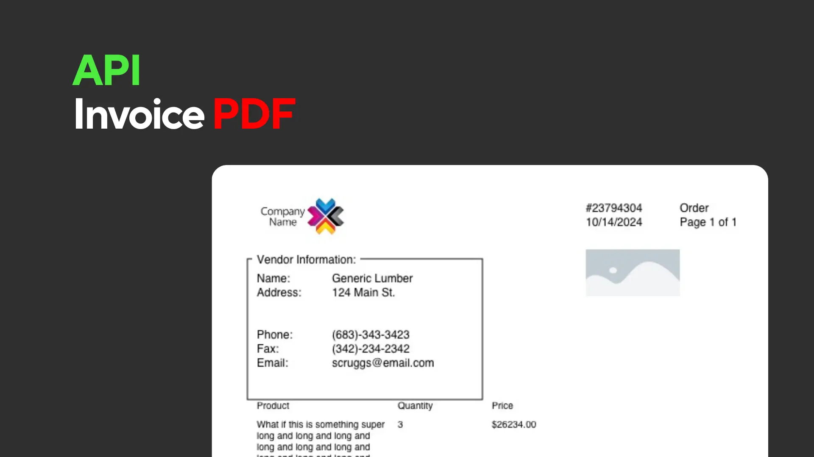

# Description

Sample Api for creating PDF invoices and quotes. Made with Express and TypeScript.

# Requirements

- node.js
- npm

There aren't many libraries that can create PDFs for free and don't need some kind of browser component or kit to work.
This project uses "pdf-lib" which is written purely in JavaScript, so it doesn't have any dependencies. This makes it easy to deploy on lightweight containers.

# Usage

1. Clone the repository

```bash
git clone
```

2. Install the dependencies

```bash
npm install
```

3. Run the server

```bash
npm run dev
```

# Endpoints

- POST /order/pdf

```json
{
  "distributorName": "Generic Lumber",
  "distributorLogoUrl": "https://hughesteam.net/wp-content/uploads/2015/12/generic-logo-star-dark.png",
  "retailerName": "Retailer Name",
  "retailerLogoUrl": "https://api.carloslespin.com/bucket/doors/door1.png",
  "customerName": "Customer Name",
  "customerAddress": "124 Main St.",
  "customerPhone": "(683)-343-3423",
  "customerFax": "(342)-234-2342",
  "customerEmail": "generic@email.com",
  "orderNumber": "23794304",
  "orderDate": "10/14/2025",
  "total": "243.53",
  "orderItems": [
    {
      "name": "What if this is something super long and long and long and long and long and long and long and long and long and long and long and long and long and long.",
      "quantity": "3",
      "price": "26234.00"
    },
    {
      "name": "Product Name",
      "quantity": "2.5",
      "price": "264.00"
    },
    {
      "name": "What if this is something super long and long and long and long and long and long and long and long and long and long and long and long and long and long.",
      "quantity": "3",
      "price": "26234.00"
    },
    {
      "name": "What if this is something super long and long and long and long and long and long and long and long and long and long and long and long and long and long.",
      "quantity": "3",
      "price": "26234.00"
    },
    {
      "name": "Product Name",
      "quantity": "2.5",
      "price": "264.00"
    },
    {
      "name": "What if this is something super long and long and long and long and long and long and long and long and long and long and long and long and long and long.",
      "quantity": "3",
      "price": "26234.00"
    }
  ]
}
```
